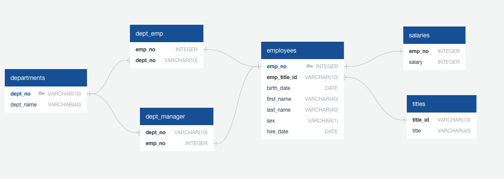
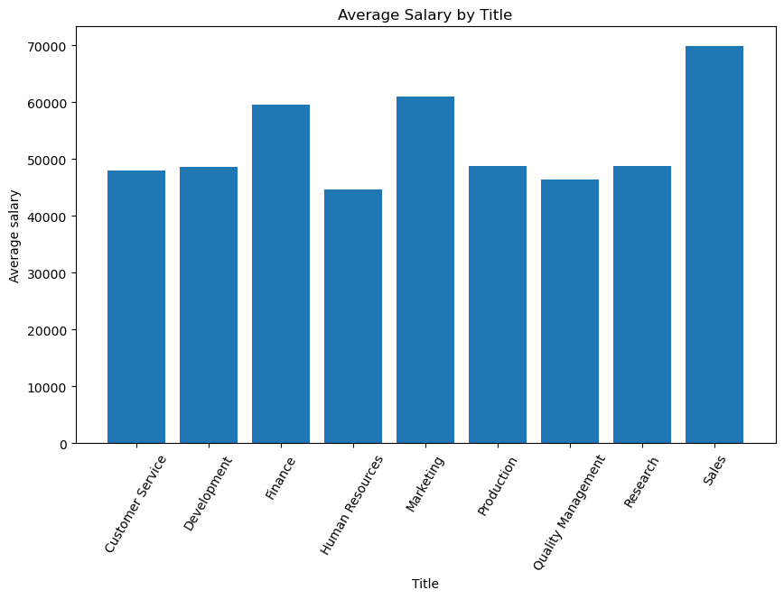

# sql-challenge
Module 9 Challenge

# Background

It’s been two weeks since you were hired as a new data engineer at Pewlett Hackard (a fictional company). Your first major task is to do a research project about people whom the company employed during the 1980s and 1990s. All that remains of the employee database from that period are six CSV files.
For this project, you’ll design the tables to hold the data from the CSV files, import the CSV files into a SQL database, and then answer questions about the data. That is, you’ll perform data modeling, data engineering, and data analysis, respectively.

# Data Engeneering

Inspect the CSV files, and then sketch an Entity Relationship Diagram of the tables.

# Data Analisys

Data Analisys could be found it the folder EmployeeSQL.

- schema.sql
- query.sql
- (Optional) Create a Jupyter notebook of the bonus analysis. 
  - python_code.ipynb
  
# Python Analisys

First of all I have imported Data Base to Jupiter notebook. Then created Data Frames for tables and after merging tables done analisys.
I have found out that the Sales department has the highest salaries.

